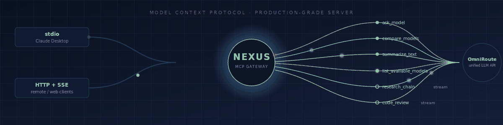
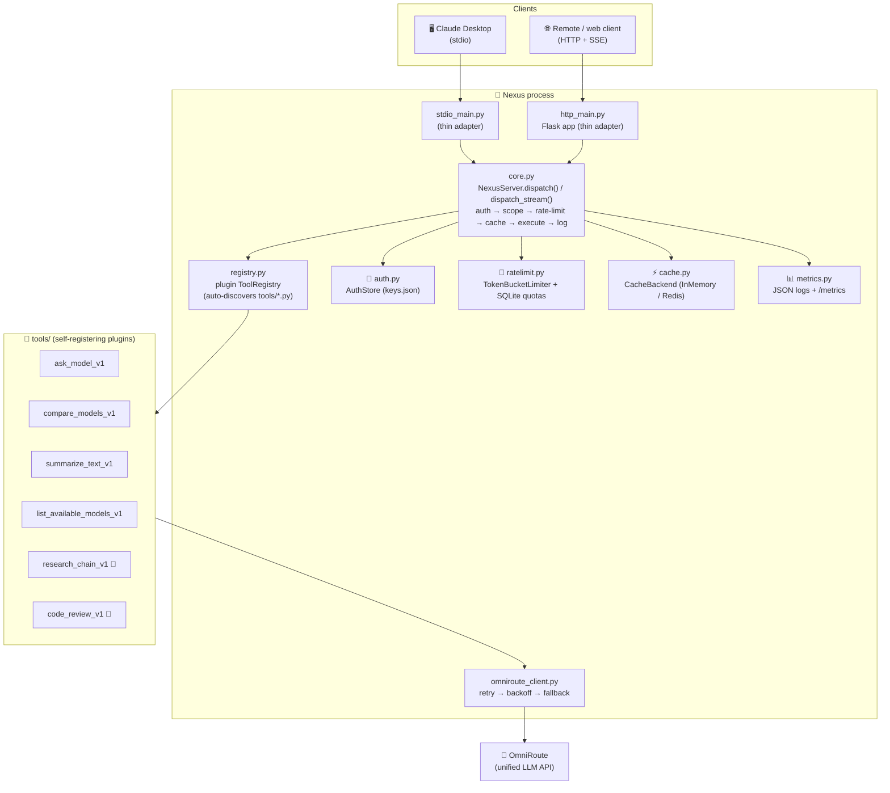

<p align="center">
  
</p>

<p align="center">
  
  
  
  
  <a href="https://github.com/tanishcode-12/Nexus/actions/workflows/ci.yml"></a>

# 🔀 Nexus

An MCP server backed by **OmniRoute** (your unified LLM gateway), exposing `ask_model`,
`compare_models`, `summarize_text`, `list_available_models`, `research_chain`, and `code_review`
as MCP tools — with 🔐 auth/scoping, 🚦 per-key rate limiting and quotas, ⚡ caching, 📡 streaming,
📊 structured observability, and 🛟 graceful degradation, over both **stdio** (Claude Desktop) and
**HTTP+SSE** (remote clients).

This README is written to be read start to finish once, then used as a reference. **[🔍 What's
tested vs. untested](#whats-tested-vs-untested)** near the end is the most important section if
you're deciding whether to trust this in production — read that before you deploy it.

## 📋 Table of contents

- [🏗️ Architecture](#architecture)
- [🚀 Quickstart](#quickstart)
- [🧰 Tool reference](#tool-reference)
- [🔐 Auth & scoping](#auth-scoping)
- [🚦 Rate limiting & quotas](#rate-limiting-quotas)
- [⚡ Caching](#caching)
- [📡 Streaming](#streaming)
- [📊 Observability](#observability)
- [🛟 Graceful degradation](#graceful-degradation)
- [🔖 Schema versioning](#schema-versioning)
- [🧪 Running the load test](#running-the-load-test)
- [🐳 Docker](#docker)
- [⚖️ Design decisions & tradeoffs](#design-decisions-tradeoffs)
- [🔍 What's tested vs. untested](#whats-tested-vs-untested)

<a id="architecture"></a>

## 🏗️ Architecture



Both transports are thin adapters over one shared `NexusServer` instance — all tool logic, auth,
rate limiting, caching, and logging live in `core.py` and are exercised identically regardless of
which transport a request came in on. Neither adapter contains a single line of tool logic.

<a id="quickstart"></a>

## 🚀 Quickstart

```bash
python -m venv .venv && source .venv/bin/activate      # Windows: .venv\Scripts\activate
pip install -r requirements-dev.txt
cp .env.example .env                                    # then edit .env
cp keys.json.example keys.json                          # then edit keys.json — see below
```

Edit `.env`: at minimum set `OMNIROUTE_BASE_URL` and `OMNIROUTE_API_KEY` to point at your real
OmniRoute instance. Edit `keys.json`: replace the example API keys with real ones.

**🖥️ Run over stdio** (for Claude Desktop — add to its MCP server config):

```json
{
  "mcpServers": {
    "nexus": {
      "command": "python",
      "args": ["/absolute/path/to/nexus/stdio_main.py"],
      "env": { "NEXUS_API_KEY": "sk-nexus-admin-CHANGE-ME" }
    }
  }
}
```

(`NEXUS_API_KEY` is how stdio clients authenticate — there's no per-request header concept over
stdio, so it's one key per configured server entry, set once via env var.)

**🌐 Run over HTTP:**

```bash
python http_main.py                       # dev: Flask's built-in server, threaded=True
# or, for anything resembling production:
gunicorn --bind 0.0.0.0:8080 --workers 1 --threads 8 --worker-class gthread wsgi:app
```

Then:

```bash
curl http://localhost:8080/healthz
curl http://localhost:8080/v1/tools -H "X-API-Key: sk-nexus-admin-CHANGE-ME"
curl -X POST http://localhost:8080/v1/tools/call \
  -H "X-API-Key: sk-nexus-admin-CHANGE-ME" -H "Content-Type: application/json" \
  -d '{"tool": "ask_model_v1", "arguments": {"prompt": "hello"}}'
```

**🧪 Run tests:** `pytest` (93 tests, ~4s, entirely self-contained — no external network needed,
see [🔍 What's tested](#whats-tested-vs-untested) below).

<a id="tool-reference"></a>

## 🧰 Tool reference

All tools are versioned (`_v1` suffix — see [🔖 Schema versioning](#schema-versioning)) and
registered via `@tool(...)` in their own file under `tools/`. Adding a tool means dropping in a
new file; nothing else needs editing.

| Tool                       | Scope required | Streaming | Description                                                                                                               |
| -------------------------- | -------------- | :-------: | ------------------------------------------------------------------------------------------------------------------------- |
| `ask_model_v1`             | `model:read`   |     –     | Ask one model a prompt.                                                                                                   |
| `compare_models_v1`        | `model:read`   |     –     | Ask multiple models the same prompt concurrently; partial failure isn't total failure.                                    |
| `summarize_text_v1`        | `model:read`   |     –     | Summarize text in ≤ `max_words` words (hard-truncated as a safety net if the model overshoots).                           |
| `list_available_models_v1` | `model:read`   |     –     | List model ids OmniRoute currently exposes.                                                                               |
| `research_chain_v1`        | `model:read`   |    📡     | Chains research → synthesis; streams the research result back before synthesis starts.                                    |
| `code_review_v1`           | `code:review`  |    📡     | Reviews code; for inputs over 40 lines, chunks by line count, reviews + streams each chunk, then streams a final summary. |

`code_review_v1` requiring a separate `code:review` scope (rather than `model:read`) is the
concrete example of scoping from the spec — a read-only key can list models and ask questions,
but can't run code review. 🔒

Every result includes `"error": true/false`; on error, `"error_type"` and `"message"`. Streaming
tools yield a sequence of chunks, each with `"partial": true` except the last.

<a id="auth-scoping"></a>

## 🔐 Auth & scoping

Every request needs an API key: an env var (`NEXUS_API_KEY`) for stdio, an `X-API-Key` header for
HTTP. Keys map to scopes in `keys.json` (`keys.json.example` shows the format, including optional
per-key rate/quota overrides). `"admin"` is a wildcard scope that bypasses all scope checks.

Enforcement happens in exactly **one place**: `NexusServer.dispatch()`/`dispatch_stream()` in
`core.py`. The Flask adapter's `require_api_key` decorator only checks that a key is _present_ and
_known_, rejecting early with 401 — the actual per-tool scope check happens once, centrally, so
it's identical for stdio and HTTP and can't drift between them.

<a id="rate-limiting-quotas"></a>

## 🚦 Rate limiting & quotas

Two independent layers, checked in order:

1. **Token bucket** (`ratelimit.py: TokenBucketLimiter`) — in-memory, per API key, for
   burst/sustained rate limiting. Configurable capacity + refill rate, globally (`.env`) or
   per-key (`keys.json`).
2. **Daily/monthly quota** (`SqliteQuotaStore`) — persisted counters, so they survive restarts.

Either layer failing returns a structured `rate_limited` error (HTTP 429; stdio gets the same
`error_type` in the tool result, since there's no HTTP status code concept over stdio).

> 🐛 **A real bug this project's test suite caught:** both layers originally used `value or default`
> to apply per-key overrides. `0.0` is a legitimate "hard cap, no refill" setting — but it's also
> falsy in Python, so `0.0 or default` silently discarded it and used the default instead. A
> tight-rate-limit test only caught this because a real HTTP round-trip was slow enough to expose
> it; a same-microsecond unit test had missed it. Both spots now use explicit `is not None` checks.

<a id="caching"></a>

## ⚡ Caching

`cache.py` defines an abstract `CacheBackend` (`get`/`set`/`delete`) with two implementations:
`InMemoryCache` (dict + TTL, the default) and `RedisCache` (same interface, for multi-process
deployments). The cache key is a SHA-256 hash of the normalized `(tool, arguments)` pair — key
order doesn't matter, only content does. Only `ask_model_v1` is cached (matching the spec); a
cache hit logs **zero** token usage/cost, since nothing new was actually spent.

<a id="streaming"></a>

## 📡 Streaming

Flask/WSGI is synchronous; Nexus's tool handlers are async (they await OmniRoute HTTP calls).
`sse_bridge.py` reconciles this: it runs the async generator to completion on a background thread
with its own event loop, relaying each chunk across a `queue.Queue` to the synchronous generator
Flask actually streams out via `Response(generator, mimetype="text/event-stream")`.

<a id="observability"></a>

## 📊 Observability

Every request logs one structured JSON line (`metrics.py: JsonFormatter`) with timestamp, tool,
hashed API key, latency, tokens used, cost estimate, success/failure, and error type if failed.
`GET /metrics` exposes Prometheus-text counters (requests, errors, avg latency, cache hits) per
tool, backed by `MetricsRecorder` — testable standalone, no Flask/server required.

> 🐛 **A gap this project's own review caught** (not any test, until one was added for it):
> `tokens_used`/`cost_estimate` were sitting in every tool result but `core.py`'s logging call
> never actually forwarded them to the metrics recorder — despite the spec explicitly requiring
> them in every log line. Fixed, with a regression test that would fail if it regressed.

<a id="graceful-degradation"></a>

## 🛟 Graceful degradation

`omniroute_client.py` retries failed completions up to `max_retries` (default 2) with exponential
backoff, then falls back to `NEXUS_FALLBACK_MODEL` if configured, then raises a typed
`OmniRouteError` that every call site turns into a clean structured error — never an unhandled
exception. This is enforced at two levels: inside `OmniRouteClient` for upstream failures, and
again as a last-resort `except Exception` in `core.dispatch()`/`dispatch_stream()` for bugs in a
tool handler itself (proven by `test_unhandled_exception_never_escapes_dispatch`, which registers
a handler that unconditionally raises and confirms it comes back as a clean error, not a crash).

<a id="schema-versioning"></a>

## 🔖 Schema versioning

Every tool name ends in `_v1` (`ask_model_v1`, not `ask_model`). A future breaking change ships as
`ask_model_v2`, registered alongside `_v1` with `deprecated=True` set on the old `ToolSpec` once
clients have migrated (`list_tools()` already filters out anything `deprecated`) — existing
clients calling `ask_model_v1` keep working unchanged. No `_v2` exists yet; this is the documented
pattern for when one's needed, per the spec's explicit ask.

<a id="running-the-load-test"></a>

## 🧪 Running the load test

```bash
python scripts/load_test.py --base-url http://127.0.0.1:8080 --api-key sk-... \
  --concurrency 20 --requests-per-client 10
```

This was actually run once against a real live instance in the sandbox this was built in (a real
Flask process + a real fake-OmniRoute HTTP server, both bound to real localhost ports — not
mocked), with two keys:

<details>
<summary><b>✅ Generous key</b> (capacity 1000, refill 500/s), 20 concurrent clients × 10 requests</summary>

```json
{
  "total_requests": 200,
  "status_counts": { "200": 200 },
  "latency_ms": {
    "min": 6.68,
    "p50": 13.32,
    "p95": 692.58,
    "max": 1474.16,
    "mean": 87.08
  }
}
```

All 200 succeeded — but note the p95/max latency tail. That's flagged, not buried: it's most
likely Werkzeug's dev-server threading model and/or SQLite lock contention on the quota-counter
table under concurrent writes to the same key, not root-caused with profiling. It's a real signal
that the dev server and SQLite-under-heavy-concurrency both deserve scrutiny before trusting this
under real load — see [⚖️ Tradeoffs](#design-decisions-tradeoffs) below.

</details>

<details>
<summary><b>🚦 Tight key</b> (capacity 5, refill 0.5/s), same load</summary>

```json
{
  "total_requests": 200,
  "status_counts": { "429": 195, "200": 5 },
  "latency_ms": {
    "min": 14.51,
    "p50": 53.45,
    "p95": 59.48,
    "max": 92.06,
    "mean": 53.04
  }
}
```

Exactly what a 5-token bucket under a fast burst should do: first 5 through, the rest 429'd. ✅

</details>

This is **one process, in-memory rate limiter, SQLite quotas** — see below for what it doesn't
tell you.

<a id="docker"></a>

## 🐳 Docker

```bash
docker compose up --build
```

Runs Nexus (gunicorn, `gthread` worker, per the Dockerfile) + Redis. Set `NEXUS_CACHE_BACKEND=redis`
(already the compose default) to actually exercise Redis rather than in-memory caching.

> ⚠️ **Verified without Docker itself:** Docker isn't available in the sandbox this was built in, so
> the actual `docker build`/`docker compose up` cycle has **not** been run. What _has_ been
> verified directly: `gunicorn --workers 1 --threads 8 --worker-class gthread wsgi:app` was run for
> real and hit with real HTTP requests (`/healthz`, `/v1/tools`) — so the command the Dockerfile's
> `CMD` runs is confirmed correct. (An earlier draft of the `CMD` used
> `http_main:_build_default_server()[0]`, assuming gunicorn could parse an indexing expression after
> a factory call — reading gunicorn's actual `import_app` source showed it only accepts a bare name
> or a call with literal arguments, so that would have failed at container startup. Replaced with a
> small dedicated `wsgi.py` module instead, and confirmed that one actually boots under gunicorn.)
> Run `docker compose up --build` yourself before trusting the image; please report back if
> anything doesn't match what's described here.

<a id="design-decisions-tradeoffs"></a>

## ⚖️ Design decisions & tradeoffs

**Flask, not the MCP SDK's own HTTP transport.** The MCP Python SDK ships ASGI-based HTTP/SSE
transports (Starlette + uvicorn) that don't mount inside Flask's WSGI model. Per an explicit
requirement to stay on Flask, `http_main.py` is a hand-rolled HTTP surface with the same
auth/scope/rate-limit/cache/dispatch pipeline as stdio — not a literal implementation of the
official MCP-over-HTTP wire protocol. If you need a spec-compliant MCP HTTP client to talk to
Nexus (rather than a custom client hitting `/v1/tools` and `/v1/tools/call` directly), that's the
gap this leaves.

**Flask (WSGI) over FastAPI/an ASGI framework, for the same reason as above** — consistency with
an existing stack, at the cost of needing the thread+queue bridge in `sse_bridge.py` for streaming
that an ASGI framework would give for free via native `async for`. It works and is tested, but
it's more moving parts than `async def` + `StreamingResponse` would have been.

**SQLite for rate-limit quotas, not Redis, at this scale.** Fine for one process. Two problems
appear the moment you run more than one: (1) the in-memory token bucket is _per-process_ — with
`--workers N > 1`, each gunicorn worker has its own independent bucket, so real enforced capacity
becomes (configured capacity) × (worker count), not the configured capacity. This is no longer
just a Dockerfile comment: `RateLimiter.__init__` reads `NEXUS_WORKER_COUNT` and **refuses to
start** (raises `RuntimeError`) if it's set above `1`, so a config drift here fails loudly at
startup instead of silently over-granting rate limits — see `ratelimit.py` and
`tests/test_ratelimit.py`. Bumping worker count for real still requires moving the bucket to
Redis first (an atomic Lua-script token bucket, not just swapping the cache backend); the guard
just makes sure nobody does that by accident. (2) SQLite handles concurrent writers, but not
gracefully at high concurrency — the p95/max latency tail in the load test above is a live piece
of evidence for this, not a hypothetical.

**In-memory cache vs. Redis.** Same story: in-memory is per-process and doesn't survive a
restart. `RedisCache` exists and is unit-tested (via `fakeredis`, standing in for a real Redis
server) but has never touched an actual Redis instance from this sandbox (no network egress to
one). If you flip `NEXUS_CACHE_BACKEND=redis`, test that specifically before relying on it.

**`code_review_v1`'s chunking is boundary-aware but still not a real AST/tree-sitter parse.** It
targets a line-count budget per chunk but looks for a nearby blank line or unindented line first
and cuts there, rather than always slicing at a fixed offset — so the common case (functions
separated by blank lines) no longer gets cut in half. It's still a heuristic: one long function
with no blank lines and no dedent just gets a hard cut once a chunk hits its cap, rather than an
unbounded chunk. Flagged in the tool's own docstring, not silently shipped as smarter than it is.

**`research_chain`/`code_review` "streaming" means progressive results between chained calls**,
not token-by-token streaming of a single completion. This was a deliberate reading of the spec
("stream partial results... rather than blocking until fully complete", "chains 2 model calls") —
the alternative (true token streaming) would require assuming an exact SSE delta wire-format for
OmniRoute's `stream=true` responses that isn't actually confirmed anywhere in this project;
`omniroute_client.py: stream_complete()` exists as a low-level passthrough for that if your
OmniRoute's format is confirmed and you want to wire it in, but nothing here depends on it working
correctly, and it is untested against a real OmniRoute streaming response.

**What we'd change for real production traffic:** Redis-backed token bucket (atomic Lua script,
not read-then-write) so `--workers` can go above 1; Redis for caching too (already built, just
needs a real Redis to actually verify against); an AST-aware chunker for `code_review`; and
probably moving off Flask's dev server entirely in favor of gunicorn everywhere, including local
dev, to catch concurrency issues earlier instead of first seeing them in a load test.

<a id="whats-tested-vs-untested"></a>

## 🔍 What's tested vs. untested

### ✅ Genuinely verified in this sandbox (93 tests, all passing, zero external network dependencies)

- Full auth → scope → rate-limit → cache → execute → log pipeline, both transports
- stdio: a **real subprocess** running `stdio_main.py`, spoken to over real MCP stdio protocol via
  `ClientSession` — not an in-process function call standing in for the transport
- HTTP: Flask's real test client against the real `build_app()` factory, including a real
  end-to-end run of the actual default-server construction path (`_build_default_server()`) —
  which is exactly the path that had the `keys.json` wiring bug (see below), so this coverage is
  load-bearing, not decorative
- Both streaming tools, over real Flask SSE responses, against a real (fake) OmniRoute HTTP server
  on a real localhost socket
- Retry/backoff/fallback logic against a fake server that deliberately fails on cue
- The load test, executed once against a real live single-process instance (numbers above)
- `gunicorn wsgi:app` under the `gthread` worker class, hit with real HTTP requests

### 🐛 Real bugs the process caught, fixed, and added regression tests for

_(listed because you asked for honesty, not because a build log is normally interesting)_

1. `0.0 or default` silently discarding an explicit "no refill" rate-limit override, in two places
2. `tokens_used`/`cost_estimate` never reaching the structured logs despite being required by spec
   and present in every tool result
3. `http_main.py` hardcoding `keys.json` instead of reading `config.keys_file`/`NEXUS_KEYS_FILE` —
   found by the load-test harness, which is the only thing that ever exercised the real startup
   wiring; every Flask integration test built its app via a factory that bypasses that code path
4. An invalid gunicorn `CMD` (verified against gunicorn's actual source before shipping, not
   assumed) — caught before it ever ran, not after
5. `test_config.py`'s `importlib.reload(config_module)` replaced the module's `config` singleton
   with a new object, but other modules (`http_main.py`, `auth.py`, ...) had already captured their
   own reference via `from config import config` — so the reload silently orphaned those
   references for the rest of the pytest session, breaking `test_http_wiring.py`'s regression test
   for issue #3 above whenever the full suite ran in file order (passed standalone, failed in the
   full run). Fixed by constructing `Config()` directly instead of reloading the module.

### ❌ Cannot be verified from this sandbox — needs your real environment

- Your actual OmniRoute instance. Every test here uses either a pure in-process fake or a small
  real HTTP server standing in for OmniRoute's wire format (assumed OpenAI-compatible-ish
  `/v1/chat/completions` + `/v1/models`) — never your real gateway. If its actual response shape
  differs, `omniroute_client.py` is the one place that would need updating.
- A real Redis instance — `RedisCache` is unit-tested against `fakeredis` only.
- Multi-process concurrency (`gunicorn --workers > 1`, or any horizontally-scaled deployment) —
  the in-memory rate limiter's per-process-state problem, described above, is a design-level
  certainty, not something additional local testing could confirm or refute. As of the
  `NEXUS_WORKER_COUNT` startup guard, this scenario can no longer happen silently: Nexus refuses
  to boot rather than run with the wrong effective rate limit. What's still unverified is only the
  Redis-backed token bucket that would let you actually scale past one worker — that code doesn't
  exist yet.
- The actual `docker build` / `docker compose up` cycle — Docker isn't available in this sandbox.
- The root cause of the p95/max latency tail under concurrent load — observed and reported
  honestly, not diagnosed with profiling.

If you run any of the above and something doesn't match what's described here, that's the
sandbox's assumptions being wrong, not a reason to assume the rest of this is untrustworthy —
but it's exactly the kind of gap this section exists to flag rather than paper over. 🙏